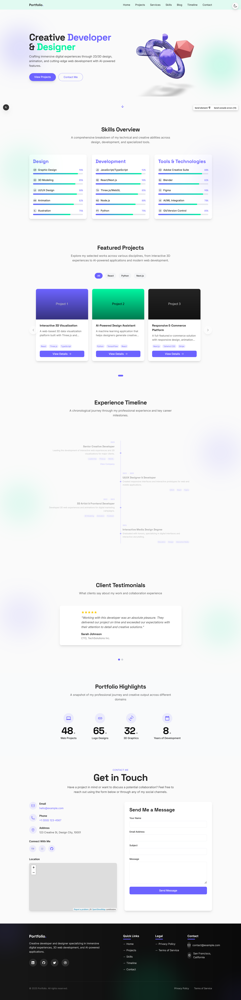

# Modern Portfolio Website

A modern, interactive portfolio website built with Next.js, TypeScript, Tailwind CSS, and Three.js. This portfolio features a responsive design, interactive 3D elements, dark/light mode, and a comprehensive admin dashboard for content management.

## Page Layout



The portfolio follows a clean, modern layout designed for optimal user experience and content presentation.

## Features

- **Interactive 3D Hero Section**: Features a customizable 3D laptop model with wireframe visualization
- **Responsive Design**: Fully responsive layout that works on mobile, tablet, and desktop
- **Dark/Light Mode**: Theme toggle with system preference detection
- **Admin Dashboard**: Complete content management system for all portfolio sections
- **Blog System**: Create, edit, and publish blog posts with markdown support
- **Project Showcase**: Display your projects with images, descriptions, and technologies used
- **Skills Section**: Visualize your technical skills with customizable progress bars
- **Timeline**: Showcase your professional journey and experiences
- **Contact Form**: Allow visitors to get in touch with you
- **SEO Optimized**: Built with best practices for search engine optimization
- **Authentication**: Secure admin access with NextAuth.js

## Tech Stack

- **Frontend**: Next.js 15, React 19, TypeScript
- **Styling**: Tailwind CSS, Framer Motion
- **3D Graphics**: Three.js, React Three Fiber, Drei
- **Authentication**: NextAuth.js
- **Deployment**: Ready for Vercel, Netlify, or any other hosting platform

## Recent Updates

### Performance Improvements (May 2025)

- **3D Model Rendering Optimization**: 
  - Optimized the 3D model rendering in hero-scene.tsx for better performance
  - Reduced unnecessary re-renders and improved loading times
- **Icon Handling Fixes**:
  - Fixed incorrect icon handling in highlights-section.tsx
  - Replaced Material Icons strings with proper react-icons components
- **Client-Side Component Improvements**:
  - Resolved chunk loading errors in client-side components
  - Optimized component loading and rendering
- **Animation Optimization**:
  - Reduced heavy animations that were impacting performance
  - Implemented more efficient animation techniques

### Code Quality Improvements (May 2025)

- **Comprehensive Lint Fixes**: Resolved all ESLint warnings and errors throughout the codebase
- **Next.js Best Practices**: 
  - Replaced all `<a>` elements with Next.js `<Link>` components for better routing performance
  - Replaced all `` elements with Next.js `<Image />` components for automatic image optimization
- **TypeScript Enhancements**:
  - Removed unused imports and variables across multiple files
  - Replaced `any` types with more specific types for better type safety
  - Changed `let` to `const` for variables that aren't reassigned
- **React Hook Optimizations**:
  - Added missing dependencies to useEffect hooks
  - Wrapped functions in useCallback to prevent unnecessary re-renders
- **JSX Improvements**:
  - Fixed unescaped entities in JSX content
  - Improved error handling in components

### Previous Updates

- **Fixed Contact Section**: Resolved syntax errors in the ContactSection component for proper functionality
- **Enhanced Admin Interface**: Added Contact section to the admin navigation menu
- **Improved User Permissions**: Updated permission system to include contact management
- **Code Cleanup**: Removed unused files and components for better maintainability
  - Removed temporary/backup files (.new, .bak)
  - Removed unused AI section component

## Admin Panel Access

To access the admin panel, navigate to `/admin/login` and use the following credentials:

- **User**: aziz3d
- **Password**: azizkhan

The admin panel provides access to manage all aspects of the portfolio including:
- Projects, Skills, and Services
- Blog posts and Timeline entries
- Contact information and social links
- Site settings and navigation

## Getting Started

### Prerequisites

- Node.js 18.x or later
- npm or yarn

### Installation

1. Clone the repository

```bash
git clone https://github.com/aziz3d/nextjs-portfolio.git
cd nextjs-portfolio
```

2. Install dependencies

```bash
npm install
# or
yarn install
```

3. Run the development server

```bash
npm run dev
# or
yarn dev
```

Open [http://localhost:3000](http://localhost:3000) with your browser to see the result.

## Project Structure

```
/src
  /app                  # Next.js App Router pages
    /admin              # Admin dashboard pages
    /api                # API routes
    /blog               # Blog pages
    /[slug]             # Dynamic pages
  /components
    /3d                 # 3D models and scenes
    /icons              # Custom and predefined icons
    /sections           # Main website sections
    /ui                 # Reusable UI components
  /data                 # Data models and static content
  /lib                  # Utility functions and helpers
  /styles               # Global styles
/public                 # Static assets
```

## Customizing the 3D Models

The portfolio features a 3D laptop model in the hero section. You can customize it by modifying the following properties:

### Size Adjustment

In `src/components/3d/hero-scene.tsx`, modify the `scale` property:

```tsx
<LaptopModel scale={1.5} wireframe={true} color="#6C63FF" rotation={[0, Math.PI * 0.25, 0]} />
```

Increase the value for a larger model, decrease for a smaller one.

### Color Adjustment

Change the `color` property to any valid CSS color:

```tsx
<LaptopModel scale={1.5} wireframe={true} color="#FF5733" rotation={[0, Math.PI * 0.25, 0]} />
```

### Rotation Adjustment

Modify the `rotation` property which takes [x, y, z] values in radians:

```tsx
<LaptopModel scale={1.5} wireframe={true} color="#6C63FF" rotation={[Math.PI * 0.1, Math.PI * 0.5, 0]} />
```

## Admin Dashboard

The portfolio includes a comprehensive admin dashboard for managing all content:

1. **Access**: Navigate to `/admin` to access the dashboard
2. **Authentication**: Login with your credentials (set up in your environment variables)
3. **Content Management**: Update profile information, projects, skills, timeline, blog posts, and more
4. **3D Model Settings**: Customize the 3D model in the hero section

## Deployment

### Deploying to Vercel

The easiest way to deploy your portfolio is using Vercel:

1. Push your code to a GitHub repository
2. Import your repository on [Vercel](https://vercel.com/import)
3. Vercel will detect Next.js and set up the build configuration automatically
4. Your site will be deployed to a Vercel URL

### Deploying to Netlify

You can also deploy to Netlify:

1. Push your code to a GitHub repository
2. Import your repository on [Netlify](https://app.netlify.com/start)
3. Set the build command to `npm run build` and publish directory to `.next`
4. Your site will be deployed to a Netlify URL

## Code Quality and Maintenance

This project follows strict code quality standards to ensure maintainability and performance:

### Linting

We use ESLint with Next.js recommended rules. Run the linter with:

```bash
npm run lint
# or
yarn lint
```

### Best Practices

1. **Next.js Components**: Always use Next.js components like `<Link>` instead of `<a>` and `<Image>` instead of `` for better performance and optimization.

2. **TypeScript**: Maintain strong typing throughout the codebase. Avoid using `any` type when possible.

3. **React Hooks**: Ensure all hooks follow React's rules of hooks, including proper dependency arrays for useEffect and useCallback.

4. **Component Structure**: Keep components focused and maintainable. Extract reusable logic into custom hooks.

5. **Error Handling**: Implement proper error boundaries and fallback UIs for a better user experience.

### Performance Monitoring

Use the built-in Next.js performance analytics to monitor your application:

```bash
npm run build
npm run start
```

Then check the console output for performance metrics.

## Contributing

Contributions are welcome! Please feel free to submit a Pull Request.

1. Ensure your code passes all lint checks
2. Add tests for new features when applicable
3. Update documentation to reflect your changes

## License

This project is licensed under the MIT License - see the LICENSE file for details.
